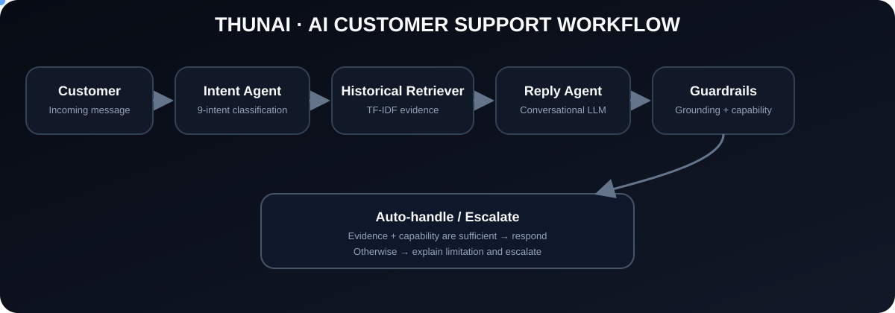

# Thunai AI Support Agent

  <b>Evidence-grounded AI customer support agent for real-world Twitter support conversations</b>

  

  
  
  
  
  
  
  
  
  

---

## Overview

Thunai is an AI-powered customer support agent designed to handle noisy, real-world customer support conversations.

The system takes an incoming customer message, understands the customer's intent, retrieves similar historical support resolutions, generates a natural response, checks the response against available evidence and system capabilities, and decides whether the conversation can be handled automatically or should be escalated.

The project focuses on a practical support-agent problem:

> How can an AI support agent produce useful, natural, evidence-grounded responses without pretending to have access to live customer systems?

### What Good Looks Like vs. What Is Not Built

| What a good support response should do | What this prototype does not claim to do |
|---|---|
| Correctly understand the customer's intent | Live Amazon order lookup |
| Use relevant historical support resolutions where available | Live delivery tracking |
| Sound natural and conversational | Real-time refund processing |
| Avoid inventing customer-specific facts | Real-time payment investigation |
| Avoid pretending to access unavailable systems | Direct account access |
| Provide useful troubleshooting when supported by evidence | Order cancellation through an external system |
| Escalate when available information is insufficient | Actual customer-data retrieval from Amazon systems |
| Remember what the customer has already tried | — |

Because these live operational systems are not connected, the agent does not claim to have performed actions that it cannot actually perform.

---

## System Workflow

Customer Message → Conversation Memory → Intent Classification → Historical Retrieval → Conversational Reply Generation → Grounding + Capability Check → Auto-handle / Escalate → Evaluation

---

## Problem Statement

Real customer support data is rarely clean. Customer messages can contain short or incomplete messages, misspellings, informal language, multilingual text, multiple issues, ambiguous requests, missing context, and repeated follow-up messages.

A useful support agent therefore needs more than a simple intent classifier.

Thunai combines intent classification, historical retrieval, conversational generation, conversation memory, grounding checks, capability checks, and escalation logic.

---

# Dataset

## Source Dataset

The project uses the Customer Support on Twitter dataset from Kaggle.

Dataset: https://www.kaggle.com/datasets/thoughtvector/customer-support-on-twitter

The original dataset contains approximately 2.8 million tweets from real customer-support conversations between customers and brands.

Important fields include:

- `tweet_id`
- `author_id`
- `inbound`
- `created_at`
- `text`
- `response_tweet_id`
- `in_response_to_tweet_id`

`inbound` represents customer-to-brand messages and `outbound` represents brand-to-customer messages.

## Brand Selection

The selected support brand is `AmazonHelp`.

AmazonHelp was selected because it provided a large number of customer messages with explicit linked support responses, making it suitable for building a historical resolution retrieval layer.

Dataset observations during preparation included approximately:

- AmazonHelp outbound messages: 169,840
- AmazonHelp inbound messages: 189,128
- Customer messages with linked AmazonHelp responses: 154,973
- Response coverage: ~81.94%

## Data Preparation

The original Twitter support dataset is large, so the project creates a focused AmazonHelp subset.

Raw Twitter Support Dataset → AmazonHelp Filtering → Conversation Thread Resolution → Connected Thread Selection → Text Cleaning → Prepared AmazonHelp Dataset

The full raw dataset is not committed to the repository. Dataset preparation is handled through scripts so that the dataset can be reproduced without storing the full raw file in GitHub.

## Prepared Dataset

The prepared dataset contains approximately 5,000 conversation threads, 23,928 tweets, 12,843 customer messages, and 11,066 AmazonHelp messages.

The prepared data contains both customer and AmazonHelp messages and preserves conversation relationships.

The data contains delivery and tracking problems, missing-delivery complaints, refund and billing issues, account-access problems, Prime-related requests, technical support issues, damaged-item complaints, cancellation requests, ambiguous and unsupported requests, multilingual messages, and customer follow-up messages.

---

# Intent Taxonomy

A 9-intent taxonomy was defined for the prepared AmazonHelp support data.

| Intent | Description |
|---|---|
| `delivery_delay` | Package is late, delayed, or tracking appears stuck |
| `missing_delivered` | Tracking says delivered but the customer cannot find the package |
| `damaged_item` | Customer reports a damaged, broken, cracked, or malfunctioning item |
| `refund_request` | Refund, billing, unauthorized charge, duplicate charge, or payment issue |
| `cancellation_request` | Customer wants an order or service cancelled |
| `account_access` | Customer cannot access or log into an account |
| `prime_membership` | Prime membership-related request |
| `technical_support` | Technical or digital-product problem |
| `other_unclear` | Ambiguous, unsupported, or unclear request |

The taxonomy is stored in `data/golden/intent_taxonomy.json`.

---

# Intent Classification

The final support workflow uses an LLM-based intent agent.

The intent agent reads the incoming customer message, reads the allowed intent taxonomy, selects exactly one supported intent, returns a confidence estimate, provides a short explanation, and uses `other_unclear` when the request is ambiguous or unsupported.

Example response:

    {
      "intent": "missing_delivered",
      "confidence": 0.98,
      "reason": "The customer states that the order tracking indicates it was delivered, but they have not received the package."
    }

The confidence value is treated as a model estimate rather than a statistically calibrated probability.

---

# Historical Resolution Retrieval

Intent classification alone is not enough to produce a useful support response.

Thunai retrieves similar historical conversations from the prepared dataset using TF-IDF, unigram and bigram features, and cosine similarity.

The retriever searches historical customer messages and their corresponding AmazonHelp support responses.

Example:

    Customer:
    "My order says delivered but it is nowhere to be found."

    Historical customer:
    "my order says it was delivered but it's nowhere to be found"

    Historical AmazonHelp response:
    "Have you tried these steps on locating a missing package?"

The retrieved response is used as supporting evidence for reply generation.

---

# Conversation Memory

Support conversations are multi-turn, so Thunai maintains conversation context.

The system uses previous customer and agent messages to understand follow-up requests.

Example:

    Customer:
    "I can't log into my Amazon account."

    Agent:
    "Try resetting your password."

    Customer:
    "I already reset my password."

    Agent:
    "Have you tried another browser?"

    Customer:
    "I already tried another browser."

    Agent:
    "Acknowledges the previous attempts and avoids repeating the same troubleshooting."

This prevents the agent from treating every customer message as a completely new conversation.

---

# Conversational Reply Generation

The reply agent is responsible for producing the customer-facing response.

The goal is to sound natural rather than return internal payloads or robotic templates.

For example:

    Customer:
    "My package says delivered, but I never received it."

    Agent:
    "I understand this is frustrating. You can double-check around your property or with neighbors in case the package was left somewhere nearby."

For follow-up messages, the agent uses conversation memory and avoids repeating troubleshooting steps that have already been attempted.

---

# Grounding and Capability Guard

A support agent should not claim actions that the system cannot actually perform.

Thunai therefore applies grounding and capability checks around generated responses.

The agent must not falsely claim that it checked an order, checked a payment, accessed an account, processed a refund, cancelled an order, investigated a shipment, or replaced an item unless those actions are actually available.

Historical support conversations can be used to support general troubleshooting guidance, but they cannot be used to confirm the current status of a specific customer's account, payment, order, or delivery.

When available information is insufficient, the agent acknowledges the limitation and recommends escalation.

---

# Escalation Logic

The escalation layer determines whether a request can be handled safely using available evidence and capabilities.

Requests that may require escalation include customer-specific payment investigation, duplicate-payment confirmation, account-specific access problems, live order investigation, requests requiring private customer information, and unsupported operational actions.

Example:

    Decision: Escalate

    Reason:
    The request requires customer-specific payment information that is not available to the agent.

The system returns a reason along with the decision rather than only a boolean value.

---

# Golden Evaluation Set

A protected golden evaluation set is used as the trusted evaluation dataset.

Prepared Customer Messages → Candidate Selection → Review and Labeling → Golden Evaluation Set → Final Evaluation

The final evaluation file is `data/golden/golden_set.csv`.

The file contains `tweet_id`, `customer_text`, `gold_intent`, `notes`, and `source`.

The golden evaluation examples are kept separate from training data to reduce evaluation leakage.

---

# Silver Training Data

The original Twitter dataset does not contain intent labels.

Automatically generated silver labels are therefore used to create training data for the classical baseline.

Silver labels are automatically generated, useful for baseline development, potentially noisy, and not treated as human truth.

The golden set is excluded from silver training data.

Current silver training dataset:

- Training examples: 1,609
- Intents: 9
- Golden-set leakage: PASSED

Distribution:

    refund_request        357
    other_unclear         300
    delivery_delay        272
    missing_delivered     155
    damaged_item          153
    account_access        130
    cancellation_request  128
    prime_membership       88
    technical_support      26

---

# Evaluation

The evaluation framework compares Thunai against two required baselines and evaluates reply quality separately.

## Baseline 1: Majority Class

The majority baseline always predicts the most common intent.

- Majority intent: `other_unclear`
- Accuracy: 45.50%
- Macro-F1: 0.0695

This demonstrates how class imbalance can make raw accuracy misleading.

## Baseline 2: TF-IDF + Logistic Regression

The second baseline uses TF-IDF and Logistic Regression.

- Accuracy: 63.50%
- Macro-F1: 0.4950

---

# Thunai Results

The end-to-end Thunai evaluation was run on the protected 200-example evaluation set.

- Evaluation examples: 200
- Successful examples: 198
- Intent accuracy: 74.75%

This is the end-to-end intent accuracy observed from the existing evaluation harness.

---

# Intent-Level Baseline Results

| Intent | Precision | Recall | F1 | Support |
|---|---:|---:|---:|---:|
| `account_access` | 0.60 | 0.75 | 0.67 | 8 |
| `cancellation_request` | 0.50 | 0.33 | 0.40 | 3 |
| `damaged_item` | 0.56 | 0.63 | 0.59 | 8 |
| `delivery_delay` | 0.63 | 0.41 | 0.50 | 41 |
| `missing_delivered` | 0.45 | 0.63 | 0.53 | 8 |
| `other_unclear` | 0.66 | 0.89 | 0.76 | 91 |
| `prime_membership` | 0.50 | 0.09 | 0.15 | 11 |
| `refund_request` | 0.69 | 0.43 | 0.53 | 21 |
| `technical_support` | 0.67 | 0.22 | 0.33 | 9 |

---

# Reply Quality Evaluation

Reply quality was evaluated using an LLM judge over a deterministic sample of 30 examples from the existing end-to-end evaluation results.

| Criterion | Score / 5 |
|---|---:|
| Correctness | 3.53 |
| Grounding | 3.73 |
| Helpfulness | 3.37 |
| Brand consistency | 3.97 |
| Safety | 4.97 |
| **Overall** | **3.90** |

The evaluation indicates that safety was strong, while helpfulness remained a key improvement area. The system deliberately avoids making unsupported live-system claims, which can sometimes make responses conservative or less actionable.

---

# Human Review of LLM Judge

The LLM judge was run on a deterministic 30-example sample from the existing end-to-end evaluation results.

The same sample was independently reviewed using the same five criteria and compared with the LLM judge qualitatively.

This review was used to check whether the automated judge was directionally aligned with human assessment and to identify cases where the automated judge appeared overly generous or conservative.

The comparison is treated as a validation signal rather than ground truth.

---

# Top 5 Failure Modes

## 1. Unsupported support intents fall into `other_unclear`

Some real customer requests do not fit the current 9-intent taxonomy cleanly, including wrong-item complaints, invoice-related requests, and unsupported operational requests.

**Hypothesis:** The taxonomy intentionally covers a limited support scope, but some meaningful customer problems are outside that scope.

**Improvement:** Analyze repeated `other_unclear` cases and expand the taxonomy only when there is sufficient evidence.

## 2. Multilingual and noisy messages

The dataset contains a substantial amount of non-English and noisy customer language. Lexical approaches can therefore become weaker when vocabulary differs from training examples.

**Hypothesis:** TF-IDF-based methods depend heavily on vocabulary overlap and language-specific patterns.

**Improvement:** Evaluate multilingual embeddings or multilingual transformer models.

## 3. Multi-intent messages

Customers can mention more than one issue in a single message.

Example: `My app is freezing and I also want a refund.`

**Hypothesis:** The current single-label taxonomy does not fully represent multi-intent support requests.

**Improvement:** Consider multi-label classification or a primary-intent plus secondary-intent design.

## 4. Overlap between related intents

Some categories naturally overlap, including `delivery_delay`, `missing_delivered`, `prime_membership`, and `refund_request`.

**Hypothesis:** Certain customer problems can legitimately appear close to more than one intent.

**Improvement:** Refine intent inclusion and exclusion criteria using observed evaluation errors.

## 5. Responses can be safe but vague

Some responses successfully avoid hallucination but do not provide enough actionable guidance.

Examples of weak filler include: `Let's explore some options.`, `Let's get this sorted.`, and `Let's troubleshoot this.`

**Hypothesis:** The grounding and capability safeguards can become overly conservative when evidence is weak.

**Improvement:** Use more targeted historical retrieval and introduce a stronger usefulness/actionability check.

---

# What Is Misleading About My Headline Number?

The headline intent accuracy of 74.75% is useful, but it should not be interpreted as a complete measure of support-agent quality.

The number has several limitations:

- The evaluation set contains 200 examples.
- `other_unclear` represents a large portion of the evaluation set.
- Accuracy alone does not describe minority-intent performance.
- Classification quality and reply quality are separate dimensions.
- Reply helpfulness was 3.37/5 in the LLM-judge evaluation.

Therefore:

> Intent accuracy is not the same thing as overall support quality.

A more informative headline is: **The agent achieved 74.75% intent accuracy on a 200-example evaluation set, while reply quality averaged 3.90/5 and helpfulness remained a key improvement area.**

---

# One-Week Improvement Plan

## Day 1–2: Improve the taxonomy

Analyze high-frequency `other_unclear` examples. Identify repeated unsupported customer problems. Introduce new intents only when supported by evaluation evidence.

## Day 3: Improve retrieval

Compare TF-IDF, BM25, sentence embeddings, and multilingual embeddings. Measure retrieval quality on difficult examples.

## Day 4: Improve reply generation

Improve evidence usage, conversational tone, actionability, avoidance of vague filler, and follow-up context.

## Day 5: Improve escalation

Combine intent, confidence, evidence availability, and capability constraints to make escalation decisions more consistent.

## Day 6: Expand evaluation

Track accuracy, Macro-F1, per-intent F1, reply quality, grounding, helpfulness, safety, and escalation accuracy.

## Day 7: Error analysis

Review the largest sources of failure and prioritize changes based on real examples.

---

# Project Architecture

Twitter Support Data → Brand Filtering → Data Cleaning → Intent Taxonomy → Intent Agent → Conversation Memory → Historical Retriever → Reply Agent → Grounding / Capability Guard → Escalation Decision → Evaluation Harness

---

# Project Structure

    hiver-ai-support-agent/
    ├── agents/
    │   ├── support_agent.py
    │   ├── intent_agent.py
    │   ├── reply_agent.py
    │   └── escalation_agent.py
    ├── backend/
    │   ├── api.py
    │   ├── pipeline.py
    │   └── schemas.py
    ├── data/
    │   ├── README.md
    │   ├── raw/
    │   ├── processed/
    │   └── golden/
    ├── evaluation/
    │   ├── build_golden_set.py
    │   ├── evaluate_classifier.py
    │   ├── evaluate_replies.py
    │   ├── llm_judge.py
    │   └── run_evaluation.py
    ├── memory/
    │   ├── conversation_memory.py
    │   └── retrieval_memory.py
    ├── scripts/
    │   ├── download_data.py
    │   ├── prepare_data.py
    │   ├── inspect_data.py
    │   ├── brand_analysis.py
    │   ├── analyze_prepared_data.py
    │   ├── discover_intents.py
    │   ├── sample_intent_examples.py
    │   └── validate_intent_taxonomy.py
    ├── frontend/
    │   ├── index.html
    │   ├── app.js
    │   └── style.css
    ├── assets/
    │   └── thunai-workflow.svg
    ├── .env.example
    ├── .gitignore
    ├── LICENSE
    ├── README.md
    ├── DECISIONS.md
    ├── REPORT.md
    ├── requirements.txt
    └── quick_start.py

---

# Technologies Used

  
  
  
  
  
  
  
  
  

| Technology | Purpose |
|---|---|
| Python | Main development language |
| FastAPI | Backend/API layer |
| Pandas | Dataset processing |
| NumPy | Efficient data processing |
| scikit-learn | TF-IDF, Logistic Regression, similarity retrieval |
| Google Gemini | LLM-based intent classification |
| Ollama | Local conversational LLM |
| Git | Version control |
| GitHub | Repository hosting |

---

# Quick Start

## 1. Clone the repository

    git clone <your-repository-url>
    cd hiver-ai-support-agent

## 2. Create a virtual environment

### Windows

    python -m venv venv
    venv\Scripts\activate

### macOS / Linux

    python3 -m venv venv
    source venv/bin/activate

## 3. Install dependencies

    pip install -r requirements.txt

## 4. Configure environment variables

Create a `.env` file based on `.env.example`.

Example:

    OLLAMA_MODEL=gemma3
    GEMINI_API_KEY=your_api_key_here

Configure only the credentials required by the components used in the current implementation.

## 5. Install the Ollama model

    ollama pull gemma3

Make sure Ollama is running before starting the application.

## 6. Prepare the dataset

Download the Customer Support on Twitter dataset from Kaggle and place the raw file at `data/raw/twcs.csv`.

Then run:

    python scripts/prepare_data.py

## 7. Run the application

    python quick_start.py

---

# Evaluation Commands

## Classifier Evaluation

    python evaluation/evaluate_classifier.py

## Reply Evaluation

    python evaluation/evaluate_replies.py

## LLM Judge

    python evaluation/llm_judge.py

---

# Reproducibility

The repository contains scripts for dataset preparation, brand analysis, intent discovery, golden-set construction, intent training-data construction, classifier evaluation, reply evaluation, and LLM judging.

Random sampling uses fixed seeds where applicable.

The golden evaluation set is protected from training-data leakage.

The current reported headline results come from the existing evaluation artifacts. Full end-to-end evaluation involves multiple LLM calls and is therefore not presented as an under-15-minute full rerun.

---

# Evaluation Deliverables

| Requirement | Implementation |
|---|---|
| Runnable repository | Full project repository |
| README | `README.md` |
| Golden evaluation set | `data/golden/golden_set.csv` |
| Intent taxonomy | `data/golden/intent_taxonomy.json` |
| Evaluation harness | `evaluation/` |
| Automated metrics | Accuracy, Macro-F1, per-intent metrics |
| LLM-as-judge | `evaluation/llm_judge.py` |
| Human review of judge | Qualitative comparison on deterministic sample |
| Baselines | Majority class + TF-IDF/Logistic Regression |
| Failure analysis | Top 5 failure modes |
| Misleading headline analysis | Included above |
| One-week improvement plan | Included above |
| Decision log | `DECISIONS.md` |

---

# Design Decisions

Important non-obvious project decisions are documented in `DECISIONS.md`.

Key decisions include selecting AmazonHelp, restricting the dataset to connected conversation threads, using a focused 9-intent taxonomy, using `other_unclear` for unsupported or ambiguous requests, protecting the golden set from leakage, using silver labels for classical baseline training, separating training and evaluation data, using historical retrieval, separating reply generation from intent classification, adding grounding and capability safeguards, evaluating reply quality separately from classification accuracy, and using an LLM judge for reply-quality evaluation.

---

# Limitations

## Dataset

The dataset consists of historical public customer-support conversations and does not provide live operational information.

## Intent Taxonomy

The current taxonomy does not represent every possible support issue.

## Multilingual Language

Noisy and multilingual customer messages remain challenging.

## Multi-intent Messages

The current classifier selects a single primary intent.

## Retrieval

TF-IDF retrieval depends strongly on lexical similarity.

## Reply Generation

The conversational model can become conservative or vague when evidence is insufficient.

## Live Operations

The prototype does not connect to live Amazon customer-service systems.

---

# Safety Principles

Thunai follows these principles:

- Never invent live customer information.
- Never claim an action that was not performed.
- Never pretend to access unavailable systems.
- Never expose private customer information.
- Use historical data as evidence rather than live status.
- Escalate when available evidence or capability is insufficient.

---

# Final Takeaway

Thunai demonstrates a practical architecture for evidence-grounded AI customer support.

The current evaluation demonstrates that the system can classify real support messages and generate conversational responses while applying safeguards against unsupported operational claims.

The next improvement step is to make the system more accurate, more grounded, more useful, more actionable, and better at knowing when to escalate.

---

# Related Documentation

### Evaluation Report

`REPORT.md`

### Decision Log

`DECISIONS.md`

### Dataset Preparation

`data/README.md`

---

# License

This project is intended for technical evaluation and demonstration purposes.
